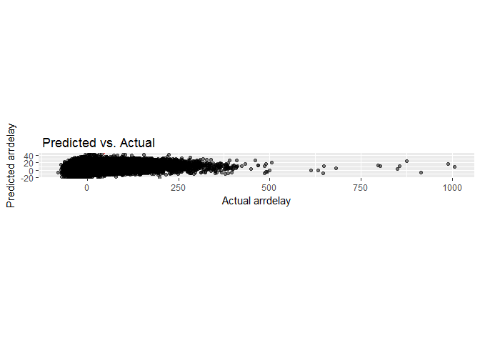
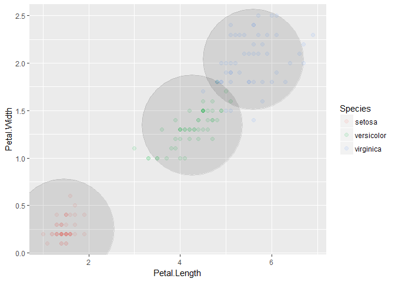

Spark
================

### CREATE SPARK ENVIRONMENT

install sparklyr

``` r
install.packages("sparklyr")
```

Select connection, new conenction, spark (local, pre-installed)

use libraries

``` r
library(sparklyr)
library(dplyr)
```

    ## 
    ## Attaching package: 'dplyr'

    ## The following objects are masked from 'package:stats':
    ## 
    ##     filter, lag

    ## The following objects are masked from 'package:base':
    ## 
    ##     intersect, setdiff, setequal, union

``` r
library(nycflights13)

sc <- spark_connect(master= "local")
```

    ## Warning in yaml.load(readLines(con), error.label = error.label, ...): R
    ## expressions in yaml.load will not be auto-evaluated by default in the near
    ## future

    ## Warning in yaml.load(readLines(con), error.label = error.label, ...): R
    ## expressions in yaml.load will not be auto-evaluated by default in the near
    ## future

    ## Warning in yaml.load(readLines(con), error.label = error.label, ...): R
    ## expressions in yaml.load will not be auto-evaluated by default in the near
    ## future

    ## * Using Spark: 2.2.0

### Storage

By default doing anything in spark, it will put the data in memory.

When saving to disk it needs hadoop.

``` r
summary(flights)
```

    ##       year          month             day           dep_time   
    ##  Min.   :2013   Min.   : 1.000   Min.   : 1.00   Min.   :   1  
    ##  1st Qu.:2013   1st Qu.: 4.000   1st Qu.: 8.00   1st Qu.: 907  
    ##  Median :2013   Median : 7.000   Median :16.00   Median :1401  
    ##  Mean   :2013   Mean   : 6.549   Mean   :15.71   Mean   :1349  
    ##  3rd Qu.:2013   3rd Qu.:10.000   3rd Qu.:23.00   3rd Qu.:1744  
    ##  Max.   :2013   Max.   :12.000   Max.   :31.00   Max.   :2400  
    ##                                                  NA's   :8255  
    ##  sched_dep_time   dep_delay          arr_time    sched_arr_time
    ##  Min.   : 106   Min.   : -43.00   Min.   :   1   Min.   :   1  
    ##  1st Qu.: 906   1st Qu.:  -5.00   1st Qu.:1104   1st Qu.:1124  
    ##  Median :1359   Median :  -2.00   Median :1535   Median :1556  
    ##  Mean   :1344   Mean   :  12.64   Mean   :1502   Mean   :1536  
    ##  3rd Qu.:1729   3rd Qu.:  11.00   3rd Qu.:1940   3rd Qu.:1945  
    ##  Max.   :2359   Max.   :1301.00   Max.   :2400   Max.   :2359  
    ##                 NA's   :8255      NA's   :8713                 
    ##    arr_delay          carrier              flight       tailnum         
    ##  Min.   : -86.000   Length:336776      Min.   :   1   Length:336776     
    ##  1st Qu.: -17.000   Class :character   1st Qu.: 553   Class :character  
    ##  Median :  -5.000   Mode  :character   Median :1496   Mode  :character  
    ##  Mean   :   6.895                      Mean   :1972                     
    ##  3rd Qu.:  14.000                      3rd Qu.:3465                     
    ##  Max.   :1272.000                      Max.   :8500                     
    ##  NA's   :9430                                                           
    ##     origin              dest              air_time        distance   
    ##  Length:336776      Length:336776      Min.   : 20.0   Min.   :  17  
    ##  Class :character   Class :character   1st Qu.: 82.0   1st Qu.: 502  
    ##  Mode  :character   Mode  :character   Median :129.0   Median : 872  
    ##                                        Mean   :150.7   Mean   :1040  
    ##                                        3rd Qu.:192.0   3rd Qu.:1389  
    ##                                        Max.   :695.0   Max.   :4983  
    ##                                        NA's   :9430                  
    ##       hour           minute        time_hour                  
    ##  Min.   : 1.00   Min.   : 0.00   Min.   :2013-01-01 05:00:00  
    ##  1st Qu.: 9.00   1st Qu.: 8.00   1st Qu.:2013-04-04 13:00:00  
    ##  Median :13.00   Median :29.00   Median :2013-07-03 10:00:00  
    ##  Mean   :13.18   Mean   :26.23   Mean   :2013-07-03 05:02:36  
    ##  3rd Qu.:17.00   3rd Qu.:44.00   3rd Qu.:2013-10-01 07:00:00  
    ##  Max.   :23.00   Max.   :59.00   Max.   :2013-12-31 23:00:00  
    ## 

``` r
flights_tbl <- copy_to(sc, flights, "flights", overwrite = TRUE)
```

### Packages to use

ft\_\* = feature transformation, working with columns

ml\_\* = machine learning tasks

sdf\_\* = spark data frames, imoprt, changes, pivot, etc with tables

spark\_\* = spark instants, spark for working with clusters

R tells Spark to do tasks, waits for it to be done, shows the result. For more than 100 million rows (depends on how wide dataset it) it starts to be slow working with R

ft function to prepare the data and basic things

sdf partition to split and test data = Sample the data

### Sample

``` r
flights_tbl %>% 
  sdf_partition(training= 0.7, test=0.3, seed=888) ->
  partition
```

### Select columns

``` r
partition$training %>% 
  ml_linear_regression(arr_delay ~ + carrier + origin + dest+ hour) ->  # consider these coulms as linear model
  fit
```

    ## * Dropped 6534 rows with 'na.omit' (235913 => 229379)

### Summary of the columns coeff

``` r
summary(fit)  # similar to Linear Model (ML) function used before ??
```

    ## Call: ml_linear_regression(., arr_delay ~ +carrier + origin + dest + hour)
    ## 
    ## Deviance Residuals: (approximate):
    ##      Min       1Q   Median       3Q      Max 
    ##  -82.714  -23.367   -9.612    8.290 1277.663 
    ## 
    ## Coefficients:
    ## (Intercept)  carrier_AA  carrier_AS  carrier_B6  carrier_DL  carrier_EV 
    ## -29.9100617  -3.0300419 -11.8354821   5.3835777  -4.0504126   9.7811115 
    ##  carrier_F9  carrier_FL  carrier_HA  carrier_MQ  carrier_OO  carrier_UA 
    ##  11.9375579   9.3848916  -2.5961287   5.0367708   5.6674725  -0.9809332 
    ##  carrier_US  carrier_VX  carrier_WN  carrier_YV  origin_JFK  origin_LGA 
    ##  -1.7077891   0.6483142   3.1074027   6.3051547  -1.4633902  -2.0501343 
    ##    dest_ACK    dest_ALB    dest_ANC    dest_ATL    dest_AUS    dest_AVL 
    ##  12.4354863  10.2553095  -0.3647614  20.8318634  10.6403883   8.0035194 
    ##    dest_BDL    dest_BGR    dest_BHM    dest_BNA    dest_BOS    dest_BQN 
    ##   3.7693383   5.3029165   6.9761447  14.1239104  10.3994233   7.5005027 
    ##    dest_BTV    dest_BUF    dest_BUR    dest_BWI    dest_BZN    dest_CAE 
    ##   8.2494682  12.2939375   7.0254237  12.7134244  25.9714438  31.9853262 
    ##    dest_CAK    dest_CHO    dest_CHS    dest_CLE    dest_CLT    dest_CMH 
    ##  18.3834161  -5.8047608  12.8959915  12.4158967  16.5179632  12.1201944 
    ##    dest_CRW    dest_CVG    dest_DAY    dest_DCA    dest_DEN    dest_DFW 
    ##   7.2921072  15.6153572  14.5375885  15.2896102  17.4610232  12.8433021 
    ##    dest_DSM    dest_DTW    dest_EGE    dest_EYW    dest_FLL    dest_GRR 
    ##  11.6529560  13.9177291  18.3212890  24.4339258  15.5774099  17.6132888 
    ##    dest_GSO    dest_GSP    dest_HDN    dest_HNL    dest_HOU    dest_IAD 
    ##  12.9329663  14.6556356  18.3047704  13.1626673  15.0286464  15.8060259 
    ##    dest_IAH    dest_ILM    dest_IND    dest_JAC    dest_JAX    dest_LAS 
    ##  15.1884902  -5.3777969  12.3685873  51.6072838  12.8640995  10.1839815 
    ##    dest_LAX    dest_LEX    dest_LGA    dest_LGB    dest_MCI    dest_MCO 
    ##   9.8345022 -23.6928991   0.0000000  -0.8373527  15.0806227  13.4205681 
    ##    dest_MDW    dest_MEM    dest_MHT    dest_MIA    dest_MKE    dest_MSN 
    ##  18.1323587  14.6704635  11.9213528  14.1754994  18.5076708  18.5431783 
    ##    dest_MSP    dest_MSY    dest_MTJ    dest_MVY    dest_MYR    dest_OAK 
    ##  16.2559802  12.9329963  13.4137850   7.0224472  13.2783967  -1.0476503 
    ##    dest_OKC    dest_OMA    dest_ORD    dest_ORF    dest_PBI    dest_PDX 
    ##  16.0803488  10.4497417  16.6228792  11.9042663  16.6734700   7.6812976 
    ##    dest_PHL    dest_PHX    dest_PIT    dest_PSE    dest_PSP    dest_PVD 
    ##  20.5923754  11.2716570  13.0874615  -7.0363739  -0.1846823  13.6643670 
    ##    dest_PWM    dest_RDU    dest_RIC    dest_ROC    dest_RSW    dest_SAN 
    ##  11.4564423  13.9446850  18.1976235  12.1531397  11.4822904  10.6202520 
    ##    dest_SAT    dest_SAV    dest_SBN    dest_SDF    dest_SEA    dest_SFO 
    ##   8.0874585  15.5314883   2.4941482  13.9760639  10.5725340  12.7333214 
    ##    dest_SJC    dest_SJU    dest_SLC    dest_SMF    dest_SNA    dest_SRQ 
    ##  -2.9755162  12.1551317  10.6502160   5.7604513   1.8567321  13.7203257 
    ##    dest_STL    dest_STT    dest_SYR    dest_TPA    dest_TUL    dest_TVC 
    ##  15.4114414  16.2193068  11.0264288  15.6495477  17.1604026  14.7867593 
    ##    dest_TYS    dest_XNA        hour 
    ##  16.0773519  13.9865040   1.6826535 
    ## 
    ## R-Squared: 0.04817
    ## Root Mean Squared Error: 43.56

### Score data

``` r
library(ggplot2)
sdf_predict(fit,partition$test)  %>%   
  sdf_register("scored_data")
```

    ## # Source:   table<scored_data> [?? x 144]
    ## # Database: spark_connection
    ##     year month   day dep_time sched_dep_time dep_delay arr_time
    ##    <int> <int> <int>    <int>          <int>     <dbl>    <int>
    ##  1  2013     1     1       NA           1500      NaN        NA
    ##  2  2013     1     1      542            540        2.      923
    ##  3  2013     1     1      544            545       -1.     1004
    ##  4  2013     1     1      557            600       -3.      709
    ##  5  2013     1     1      600            600        0.      851
    ##  6  2013     1     1      624            630       -6.      840
    ##  7  2013     1     1      627            630       -3.     1018
    ##  8  2013     1     1      643            645       -2.      837
    ##  9  2013     1     1      646            645        1.     1023
    ## 10  2013     1     1      655            700       -5.     1002
    ## # ... with more rows, and 137 more variables: sched_arr_time <int>,
    ## #   arr_delay <dbl>, carrier <chr>, flight <int>, tailnum <chr>,
    ## #   origin <chr>, dest <chr>, air_time <dbl>, distance <dbl>, hour <dbl>,
    ## #   minute <dbl>, time_hour <dbl>, dest_ABQ <dbl>, dest_ACK <dbl>,
    ## #   dest_ALB <dbl>, dest_ANC <dbl>, dest_ATL <dbl>, dest_AUS <dbl>,
    ## #   dest_AVL <dbl>, dest_BDL <dbl>, dest_BGR <dbl>, dest_BHM <dbl>,
    ## #   dest_BNA <dbl>, dest_BOS <dbl>, dest_BQN <dbl>, dest_BTV <dbl>,
    ## #   dest_BUF <dbl>, dest_BUR <dbl>, dest_BWI <dbl>, dest_BZN <dbl>,
    ## #   dest_CAE <dbl>, dest_CAK <dbl>, dest_CHO <dbl>, dest_CHS <dbl>,
    ## #   dest_CLE <dbl>, dest_CLT <dbl>, dest_CMH <dbl>, dest_CRW <dbl>,
    ## #   dest_CVG <dbl>, dest_DAY <dbl>, dest_DCA <dbl>, dest_DEN <dbl>,
    ## #   dest_DFW <dbl>, dest_DSM <dbl>, dest_DTW <dbl>, dest_EGE <dbl>,
    ## #   dest_EYW <dbl>, dest_FLL <dbl>, dest_GRR <dbl>, dest_GSO <dbl>,
    ## #   dest_GSP <dbl>, dest_HDN <dbl>, dest_HNL <dbl>, dest_HOU <dbl>,
    ## #   dest_IAD <dbl>, dest_IAH <dbl>, dest_ILM <dbl>, dest_IND <dbl>,
    ## #   dest_JAC <dbl>, dest_JAX <dbl>, dest_LAS <dbl>, dest_LAX <dbl>,
    ## #   dest_LEX <dbl>, dest_LGA <dbl>, dest_LGB <dbl>, dest_MCI <dbl>,
    ## #   dest_MCO <dbl>, dest_MDW <dbl>, dest_MEM <dbl>, dest_MHT <dbl>,
    ## #   dest_MIA <dbl>, dest_MKE <dbl>, dest_MSN <dbl>, dest_MSP <dbl>,
    ## #   dest_MSY <dbl>, dest_MTJ <dbl>, dest_MVY <dbl>, dest_MYR <dbl>,
    ## #   dest_OAK <dbl>, dest_OKC <dbl>, dest_OMA <dbl>, dest_ORD <dbl>,
    ## #   dest_ORF <dbl>, dest_PBI <dbl>, dest_PDX <dbl>, dest_PHL <dbl>,
    ## #   dest_PHX <dbl>, dest_PIT <dbl>, dest_PSE <dbl>, dest_PSP <dbl>,
    ## #   dest_PVD <dbl>, dest_PWM <dbl>, dest_RDU <dbl>, dest_RIC <dbl>,
    ## #   dest_ROC <dbl>, dest_RSW <dbl>, dest_SAN <dbl>, dest_SAT <dbl>,
    ## #   dest_SAV <dbl>, dest_SBN <dbl>, ...

``` r
tbl(sc,"scored_data") %>% 
  select(arr_delay, prediction) %>% 
  collect() -> # allows us to collect the dataset that is the predictive values
  predicted_vals
  
predicted_vals %>% 
  ggplot(aes(x = arr_delay, y = prediction)) +
  geom_abline(lty="dashed", col = "red") +
  geom_jitter(alpha=0.5) +
  coord_fixed(ratio = 1) +
  labs(
    x= "Actual arrdelay",
    y= "Predicted arrdelay",
    title = " Predicted vs. Actual"
  )
```

    ## Warning: Removed 2896 rows containing missing values (geom_point).



THis is a bad model without any preprocessing.... predicted vs actual should be a straight line.

### Kmeans in R

``` r
cl <- iris %>%
  select(Petal.Width, Petal.Length) %>% 
  kmeans(centers = 3)

centers <- as.data.frame(cl$centers)

# darker points more datapoints observed
iris %>% 
  ggplot(aes(Petal.Length, Petal.Width)) +
  geom_point(aes(colour=Species) , size=2, alpha=0.1)+
  geom_point(data=centers, size=60, alpha=0.1)
```



### Kmeans in Spark , do not need to save it as a dataframe as in R,

``` r
sc <- spark_connect(master= "local")
```

    ## Warning in yaml.load(readLines(con), error.label = error.label, ...): R
    ## expressions in yaml.load will not be auto-evaluated by default in the near
    ## future

    ## Warning in yaml.load(readLines(con), error.label = error.label, ...): R
    ## expressions in yaml.load will not be auto-evaluated by default in the near
    ## future

    ## Warning in yaml.load(readLines(con), error.label = error.label, ...): R
    ## expressions in yaml.load will not be auto-evaluated by default in the near
    ## future

    ## Re-using existing Spark connection to local

``` r
iris_tbl <- copy_to(sc,iris,"iris", overview=TRUE)
```

### Linear regression in Spark vs R

The spark data set can work over 4 Tb of data, does not work for R.

### Logistic regression with Spark vs R

For this type of model, Spark expects it to be 1 or 0, numeric value, not TRUE or FALSE

### Survival Regression, survival time of the customer (insurance, patients)
